# DockerBasics

<h1> <i> Частина I. Вступ </i> </h1>

<h2> <b> 1.	Запуск контейнера Docker за допомогою Docker Desktop. </b> </h2>

1.1. 	Відкриємо термінал командного рядка та запускаємо перший контейнер, виконавши <b>docker run</b> команду.

  

1.2. 	Відвідуємо веб-сайт <a href="http://localhost:8080">http://localhost:8080</a>.

  

1.3. 	Відкриємо Docker Desktop і виберемо поле <b>Containers</b> на лівій бічній панелі.

  

1.4. 	В вкладці <b>Exec</b> можемо отримати доступ до оболонки.

  

1.5. 	Для детальної інформації про контейнер, виберемо поле <b>Inspect</b>.

  

<h2> <b> 2. Розробка контейнерів </b> </h2>

2.1. 	В терміналі клонуємо проект <b>getting-started-todo-app</b> на локальну машину.

  

2.2. 	Переходимо до нового каталогу, створеного клоном.

  

2.3. 	Запускаємо проект за допомогою команди <b>docker compose watch</b>.

  

2.4.	В браузері відкриваємо веб-сайт <a href="http://localhost">http://localhost</a>. 

  

ㅤㅤ	В цій програмі ми можемо:   
ㅤ•  Додавати та видаляти елементи.   
ㅤㅤСкріншот створення двох предметів:

  

ㅤㅤСкріншот видалення одного з предметів:

  

ㅤ•  Визначати елемент як виконаний:

  

2.5. 	В <b>backend/src/routes</b> знаходимо файл <b>getGreeting.js</b> та відкриваємо його.

  

2.6. 	Змінюємо константу, що містить привітання <b>GREETING</b> (перший рядок файла). Замість значення <b>Hello world!</b>, додамо масив привітань.

  

2.7. 	Щоб надіслати випадкове привітання з цього списку, зробимо зміни в <b>res.send</b> (9 рядок коду).

  

2.8. 	Щоб побачити всі привітання, потрібно постійно оновлювати сторінку. З кожним оновленням буде з’являтися нове привітання.

  

2.9. 	В <b>client/src/components</b> знаходимо файл <b>AddNewItemForm.jsx</b> та відкриваємо його.

  

2.10. 	Змінюємо значення текстової підказки поля введення інформації <b>placeholder</b> (37 рядок коду) на <b>What do you need to do?</b>.

  

2.11. 	Оновлюємо веб-сторінку щоб побачити цю зміну.

  

2.12. 	В <b>client/src</b> знаходимо файл <b>index.scss</b> та відкриваємо його.

  

2.13. 	Змінюємо фон сайту <b>background-color</b> (4 рядок коду) на синій.

  

2.14. 	Знову оновлюємо веб-сторінку, тепер фон сайту має синій колір.

  

<h2> <b> 3.	Створення і просування першого образу </b> </h2>

3.1. 	Переходимо до Docker Hub <a href="https://hub.docker.com/">https://hub.docker.com/</a>.

  

3.2. 	Переходимо до вкладки <b>Repositories</b> та обираємо <b>Create repository</b>.

  

3.3. 	Даємо назву репозиторію, короткий опис та обираємо в <b>Visibility</b> загальнодоступну видимість <b>Public</b>.

 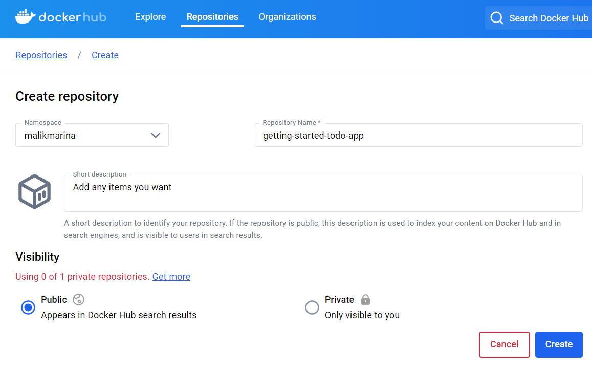 

3.4. 	Натискаємо на <b>Create</b>, після чого репозиторій буде створено.

  

3.5. 	В терміналі командного рядка створюємо проект, застосувавши команду <b>docker build -t</b>, вказавши ім’я користувача та назву проекту.

  

3.6. 	Скористаємося командою <b>docker image ls</b> для перевірки наявності Docker image.

  

3.7. 	Надсилаємо image до Docker Hub, використовуючи команду <b>docker push</b>.

  

<h1> <i> Частина II. Основні концепції контейнерів, images, реєстрів і Docker Compose. </i> </h1>

<h2> <b> 4.	Запуск контейнеру Docker за допомогою графічного інтерфейсу Docker Desktop </b> </h2>

4.1. 	Відкриємо Docker Desktop і в поле пошуку на верхній панелі навігації вказуємо <b>welcome-to-docker</b>, а потім виберемо кнопку <b>Pull</b>.

  

4.2. 	Після того, як отримали Docker image, натискаємо на кнопку <b>Run</b>. При натисканні, ми потрапляємо до вікна додаткових параметрів.

  

4.3. 	Розгортаємо <b>Optional settings</b> та вказуємо ім’я контейнеру <b>welcome-to-docker</b> та <b>8080</b> у якості хосту.

  

4.4. 	Тепер ми можемо натиснути на <b>Run</b> для запуску контейнера.

  

4.5. 	На інформаційній панелі Docker, перейшовши до вкладки <b>Containers</b>, можемо переглянути всі контейнери.

  

4.6. 	Відкриємо веб-сайт, перейшовши за посиланням в стовпці <b>Port(s)</b> чи відвідавши <a href="http://localhost:8080">http://localhost:8080</a>.

  

4.7. 	В Docker Desktop натискаємо на контейнер. Після цього обираємо вкладку <b>Files</b>, щоб дослідити ізольовану файлову систему контейнера.

  

4.8. 	Повертаємося до <b>Containers</b>, обираємо контейнер, який потрібно зупинити та зупиняємо, натиснувши на кнопку зупинення, яка знаходиться біля стовпця <b>Actions</b>.

  

4.9. 	Після чого контейнер буде призупинено.

  

<h2> <b> 5.	Пошук та витягування image контейнера за допомогою графічного інтерфейсу Docker Desktop </b> </h2>

5.1. 	В Docker Desktop у навігаційному меню ліворуч переходимо до вкладки <b>Images</b>.

 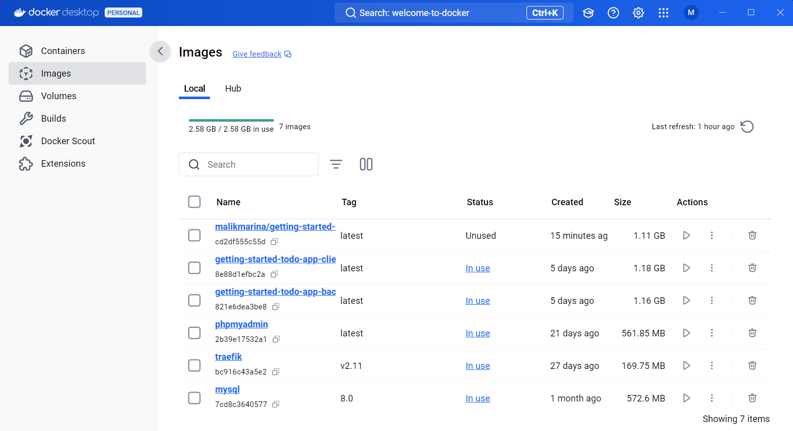 

5.2. 	В поле пошуку на верхній панелі навігації вказуємо <b>welcome-to-docker</b>, а потім натискаємо на кнопку <b>Pull</b>, щоб завантажити image.

 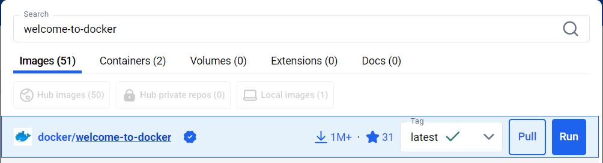 

5.3. 	Після чого в <b>Images</b> натискаємо на назву завантаженого image, щоб відкрити його детальну інформацію.

 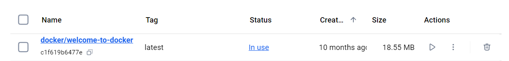 

5.4. 	Ця сторінка містить інформацію про шари, пакунки та бібліотеки, встановлені в image, а також будь-які виявлені вразливості.

  

<h2> <b> 6.	Створення та відправлення Docker image у репозиторій Docker Hub </b> </h2>

6.1. 	Заходимо в Docker Hub. В вкладці <b>Repositories</b> обираємо <b>Create repository</b> для створення репозиторію. Даємо назву <b>docker-quickstart</b> та робимо публічним.

 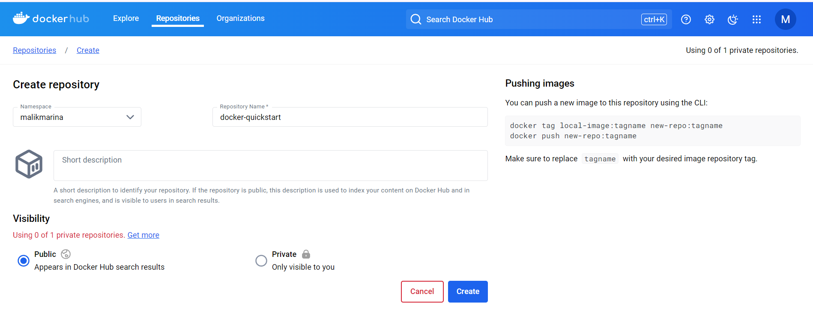 

6.2. 	Натискаємо кнопку <b>Create</b>, після чого створиться репозиторій.

 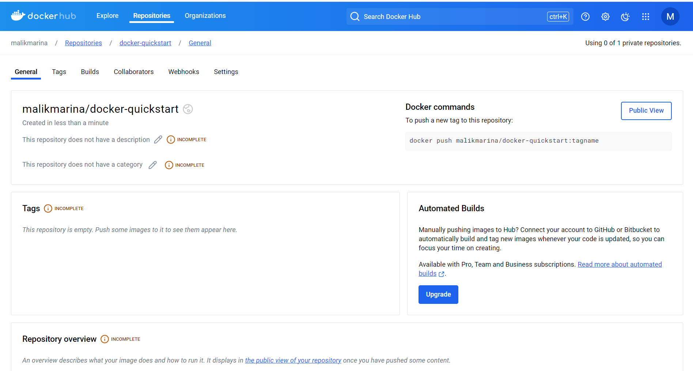 

6.3. 	В терміналі командного рядка клонуємо репозиторій GitHub за допомогою команди <b>git clone</b>.

 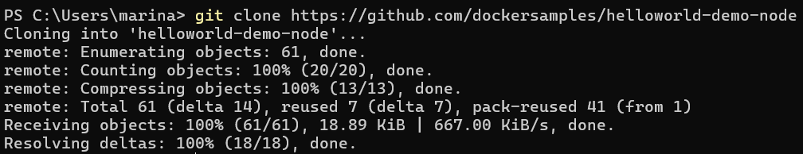 

6.4. 	Переходимо у щойно створений каталог.

 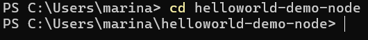 

6.5. 	Виконаємо команду <b>docker build</b>, щоб створити Docker image.

 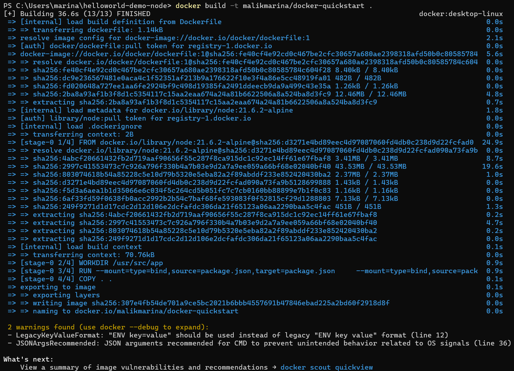 

6.6. 	Виконаємо команду, щоб отримати список щойно створеного Docker image.

 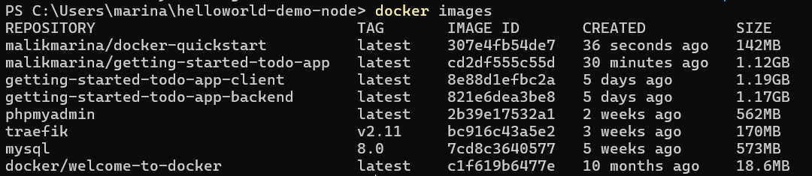 

6.7. 	Запускаємо контейнер, щоб перевірити зображення, виконавши команду <b>docker run</b>.

 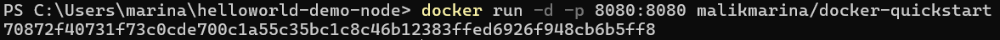 

6.8. 	Перевіряємо, чи контейнер працює, відвідавши веб-сайт <a href="http://localhost:8080">http://localhost:8080</a>.

 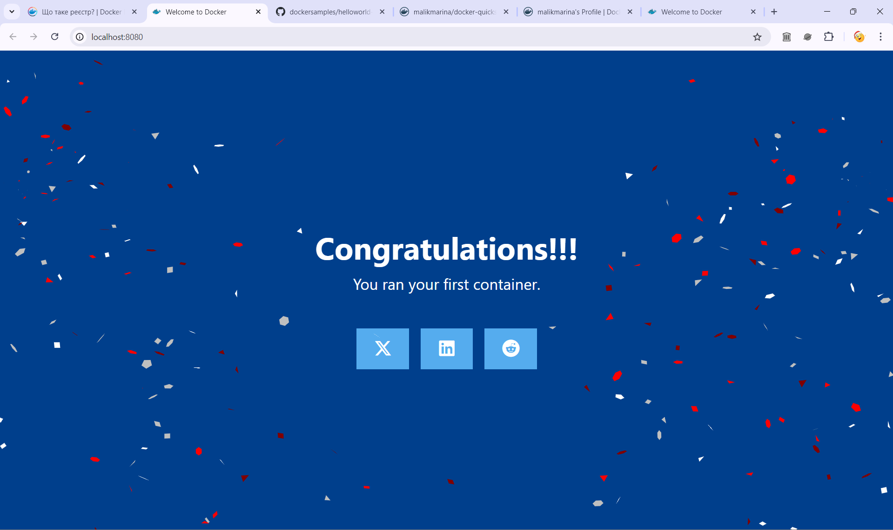 

6.9. 	Використовуємо <b>docker tag</b> команду, щоб створити тег на Docker image, що дозволяє позначати та версіонувати image.

 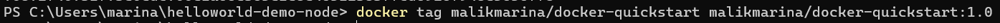 

6.10. 	Відправляємо щойно створений image у репозиторій Docker Hub за допомогою команди <b>docker push</b>.

 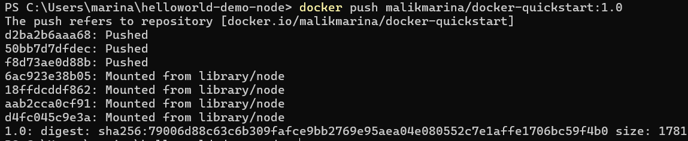 

6.11. 	Відкриваємо Docker Hub і переходимо до нашого репозиторію. Переходимо до розділу <b>Tags</b>, щоб переглянути щойно надісланий image.

 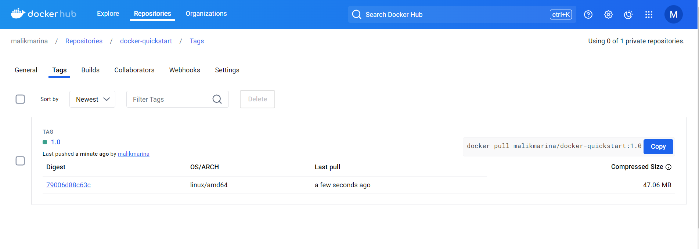 

<h2> <b> 7.	Використання Docker Compose для запуску багатоконтейнерної програми </b> </h2>

7.1. 	Відкриваємо термінал та клонуємо зразок програми.

 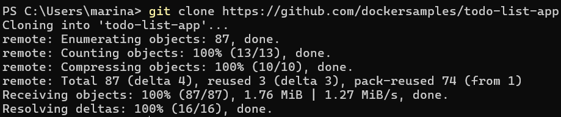 

7.2. 	Переходимо до каталогу <b>todo-list-app</b>.

 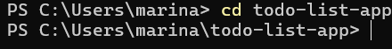 

7.3. 	Використовуємо команду <b>docker compose up</b> для запуску програми.

 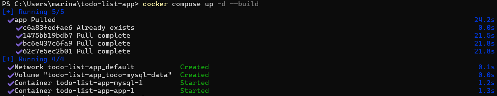 

7.4. 	Щоб переглянути сайт, відкриємо <a href="http://localhost:3000">http://localhost:3000</a>.

 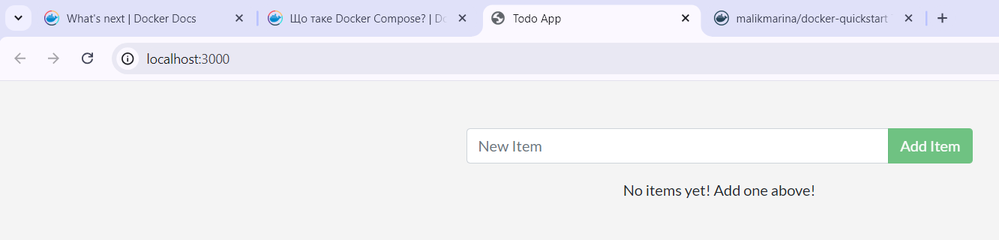 

7.5. 	В Docker Desktop у вкладці <b>Containers</b> ми зможемо побачити контейнери і зануритися в їхню конфігурацію.

 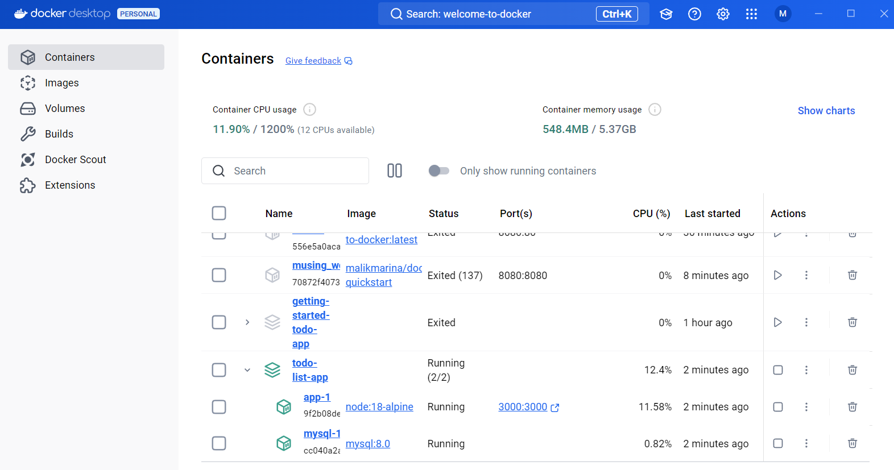 

7.6. 	Щоб видалити контейнер, в терміналі скористаємося <b>docker compose down</b>.

 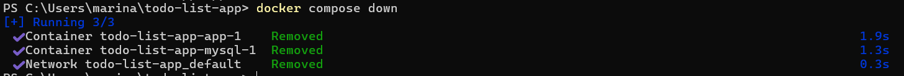 

7.7. 	В Docker Desktop у вкладці <b>Containers</b> ми помічаємо, що контейнер видалився.

 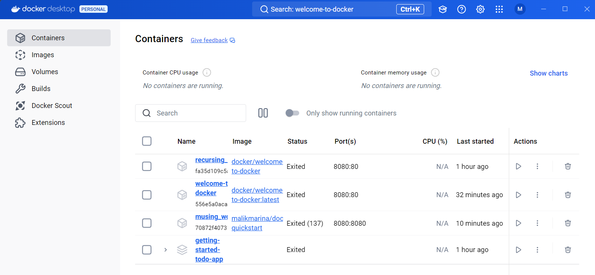 

 
